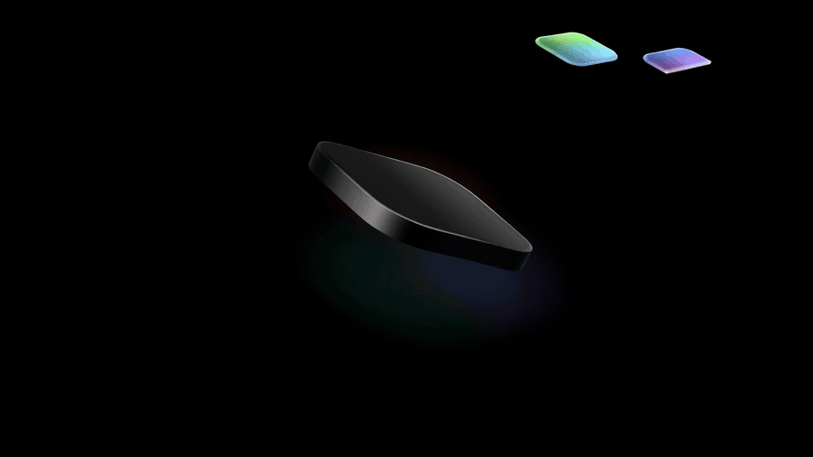
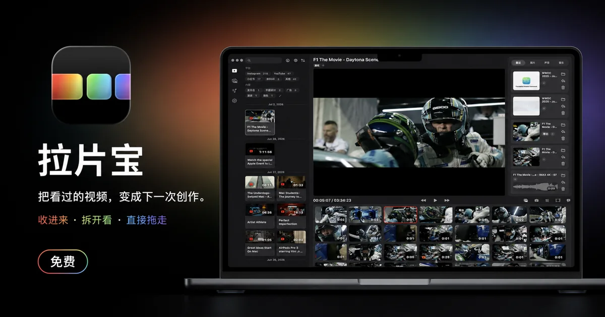
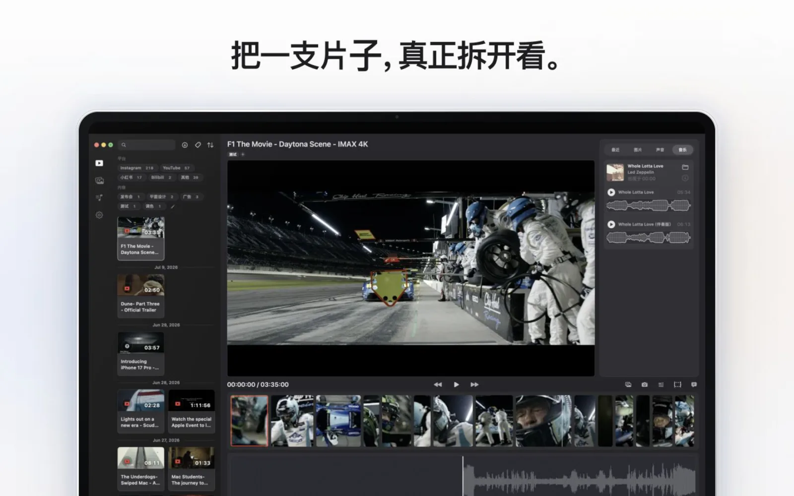
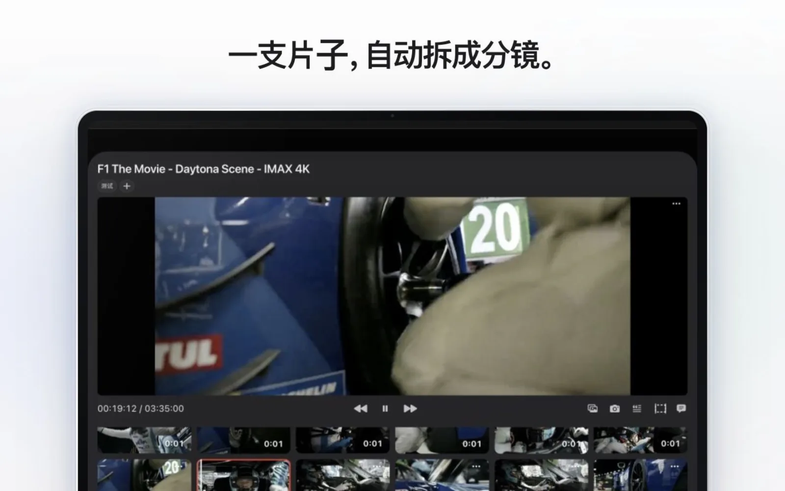
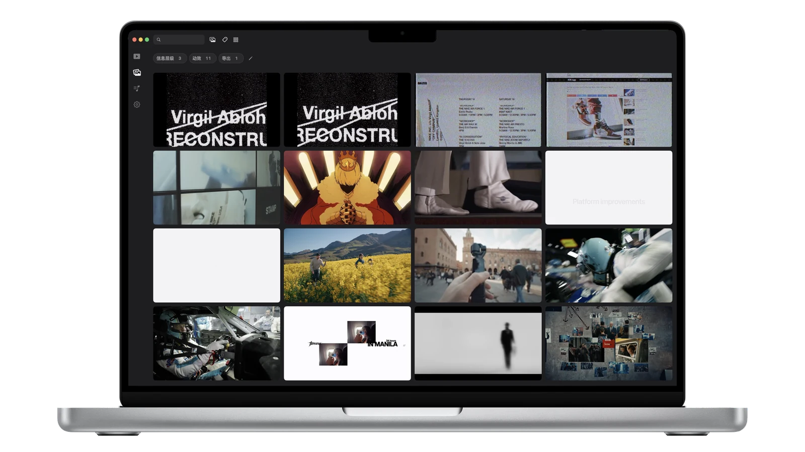
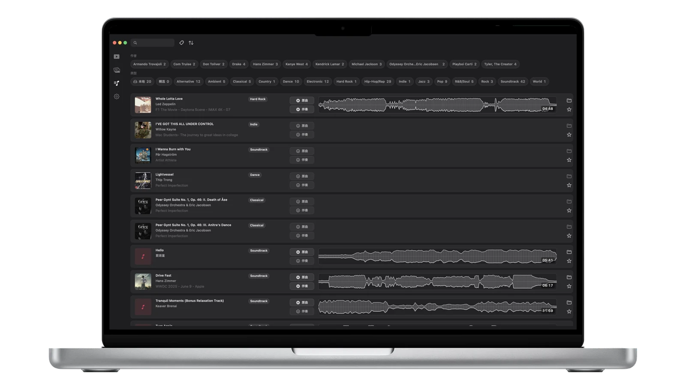

<p align="center">
  
</p>

<h1 align="center">拉片宝 · ShotPal</h1>

<p align="center"><strong>把看过的视频，变成下一次创作。</strong></p>

<p align="center">
  一款面向创作者的 macOS 本地视频拆解与素材管理工具。<br>
  收进来、拆开看，把画面、声音、字幕与音乐直接带回创作流程。
</p>

<p align="center">
  
  
  
  
</p>

<p align="center">
  
</p>

## 一支片子，真正拆开看

拉片宝把散落在文件夹和平台里的视频收进同一个本地素材库，并围绕原始时间线完成播放、场景识别、画面采样、声音截取、字幕转写、音乐识别和资产导出。所有结果都保留来源视频与时间点，需要时可以随时回到原片继续看片。

<p align="center">
  
</p>

## 从视频到可复用素材

| 01 · 收进来 | 02 · 拆开看 | 03 · 组织好 | 04 · 直接拖走 |
|:---:|:---:|:---:|:---:|
| 导入本地视频或公开链接 | 识别分镜、字幕、画面与声音 | 按来源、标签和媒体类型管理 | 导出或拖入后续创作软件 |

### 自动分镜

在本地识别场景切点，把长视频展开成可浏览、可定位、可导出的分镜板。每张代表帧都能回到原视频的准确时间点。

<p align="center">
  
</p>

### 画面素材库

把截图和场景代表帧沉淀为可搜索、可筛选的视觉素材；保留来源、标签、批注与色彩信息，不再让灵感消失在截图文件夹里。

<p align="center">
  
</p>

### 声音与音乐

沿时间线截取声音片段，查看波形并回到来源位置；识别视频中的音乐，统一管理原曲、伴奏、封面和流派标签。

<p align="center">
  
</p>

## 核心能力

- **本地素材库：** 递归扫描常见视频格式，统一管理封面、时长、帧率、来源、作者和标签。
- **网络导入：** 处理用户主动粘贴的公开视频链接，并在需要时完成兼容转码。
- **时间线拉片：** 同屏查看帧带、波形、场景切点、截图、批注、字幕和声音选区。
- **本地分析：** 使用 TransNetV2 识别场景，使用 Whisper 完成字幕转写。
- **资产回溯：** 图片、声音、字幕和音乐结果都保留来源视频与时间区间。
- **创作导出：** 输出图片、声音、Markdown 字幕与音乐文件，并支持拖拽到后续软件。

## Local-first

拉片宝优先在本机完成素材管理和媒体分析。网络导入只处理用户主动提供的链接，不读取平台账号收藏；项目数据、识别结果和导出资产均保存在用户选择的本地位置。

## 开发环境

- macOS 14 或更高版本
- Xcode（打开 `LapianBao.xcodeproj`）
- Swift / SwiftUI / AppKit / AVFoundation
- 内嵌或按需准备的 FFmpeg、Whisper、TransNetV2 等运行时工具

```bash
# Debug 构建
xcodebuild -project LapianBao.xcodeproj \
  -scheme LapianBao \
  -configuration Debug \
  -destination 'platform=macOS' build

# 轻量回归检查
python3 Tools/regression_checks.py
```

## 项目地图

```text
LapianBao/               App 主代码
├── AppStartup/          启动与窗口协调
├── Stores/              素材、下载与识别领域逻辑
├── Views/               各工作区和复用视图
├── RuntimeTools.bundle/ 本地媒体分析运行时
Tools/                   构建、检测与回归脚本
IconDrafts/              图标源文件
```

## 当前状态

当前工作分支为 **Pro 1.2**。项目已进入稳定性、分发、验收和必要修补阶段，暂不扩张大型功能或新增工作区。

> 本仓库为私有开发仓库。源码、构建产物和访问权限仅供受邀协作者使用。
