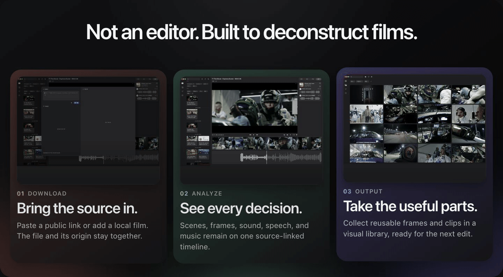
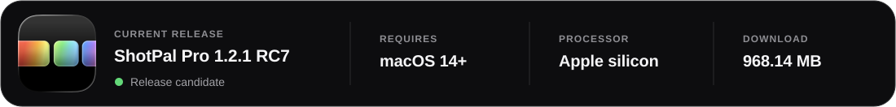
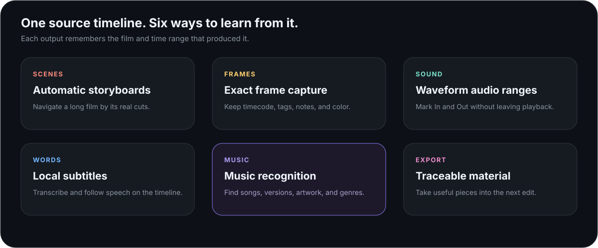
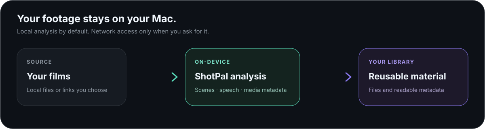

  

  

  <a href="https://shotpal.newtybei.com"><strong>Official website</strong></a>
  &nbsp;·&nbsp;
  <a href="#see-the-whole-film-without-losing-the-thread">See how it works</a>

## See the whole film without losing the thread

ShotPal keeps the player, scene cuts, frame strip, waveform, subtitles, music, and saved material around one source timeline. Every result remembers where it came from, so you can return to the exact moment that inspired it.

  

## Keep the parts worth studying

### Automatic storyboards

Turn a long video into a navigable storyboard. ShotPal detects scene changes locally, places representative frames in order, and lets every card jump back to its exact source time.

  

### Frames that keep their origin

Save the frame you are looking at—not a nearby approximation. Source video, timecode, tags, notes, and color information stay attached, making the visual library useful long after the first viewing.

  

### Sound, subtitles, and music in context

Mark an audio range on the waveform, transcribe speech locally, and identify music without leaving the film. Exported material keeps the source and time range needed to find it again.

  

## One workspace, six practical tools

  

## Your footage stays yours

  

Video analysis, scene detection, subtitle transcription, tags, and exported material stay on your Mac. Network access is used only when you explicitly import a public link or request online metadata.

## Get ShotPal Pro

| Version | Requires | Package |
|:--|:--|:--|
| **1.2.1** | macOS 14 or later · Apple silicon | DMG · 968.14 MB |

Download information, product updates, and the privacy policy are available on the **[official ShotPal website](https://shotpal.newtybei.com)**.
