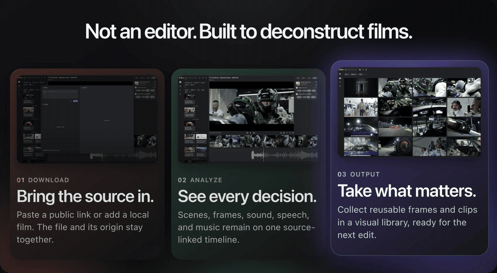
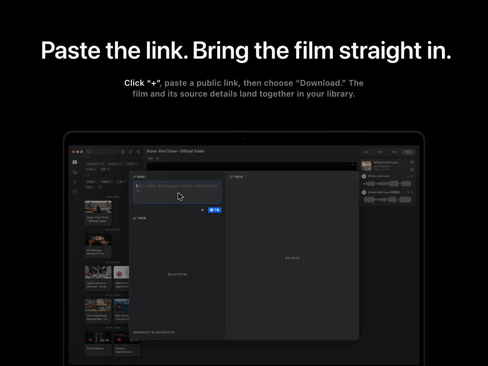
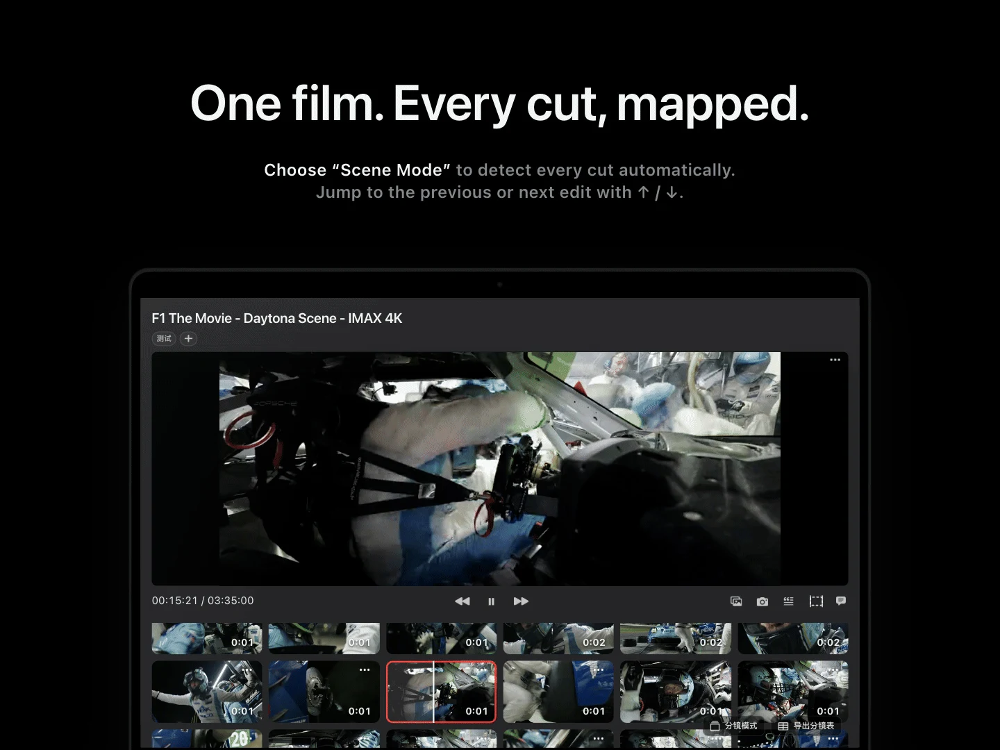
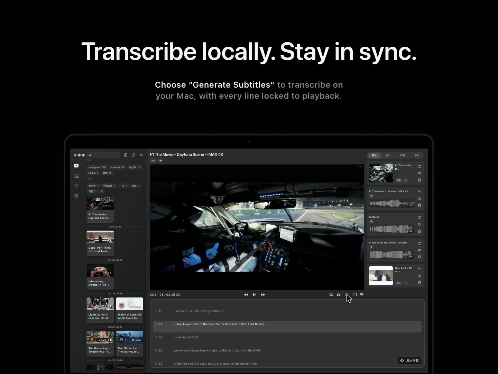
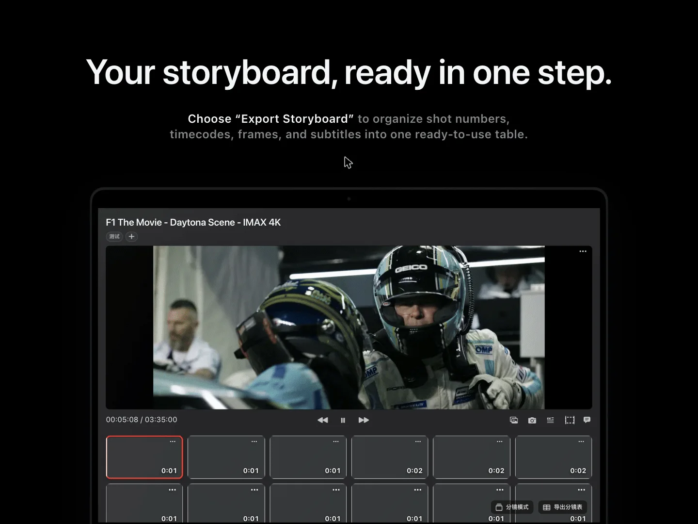
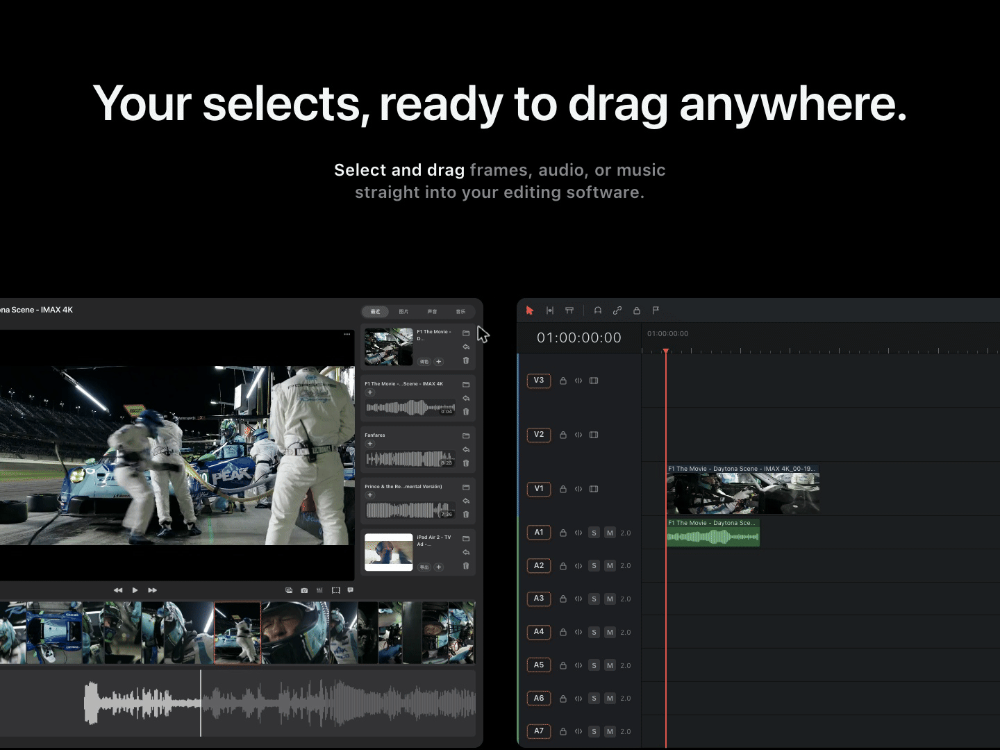
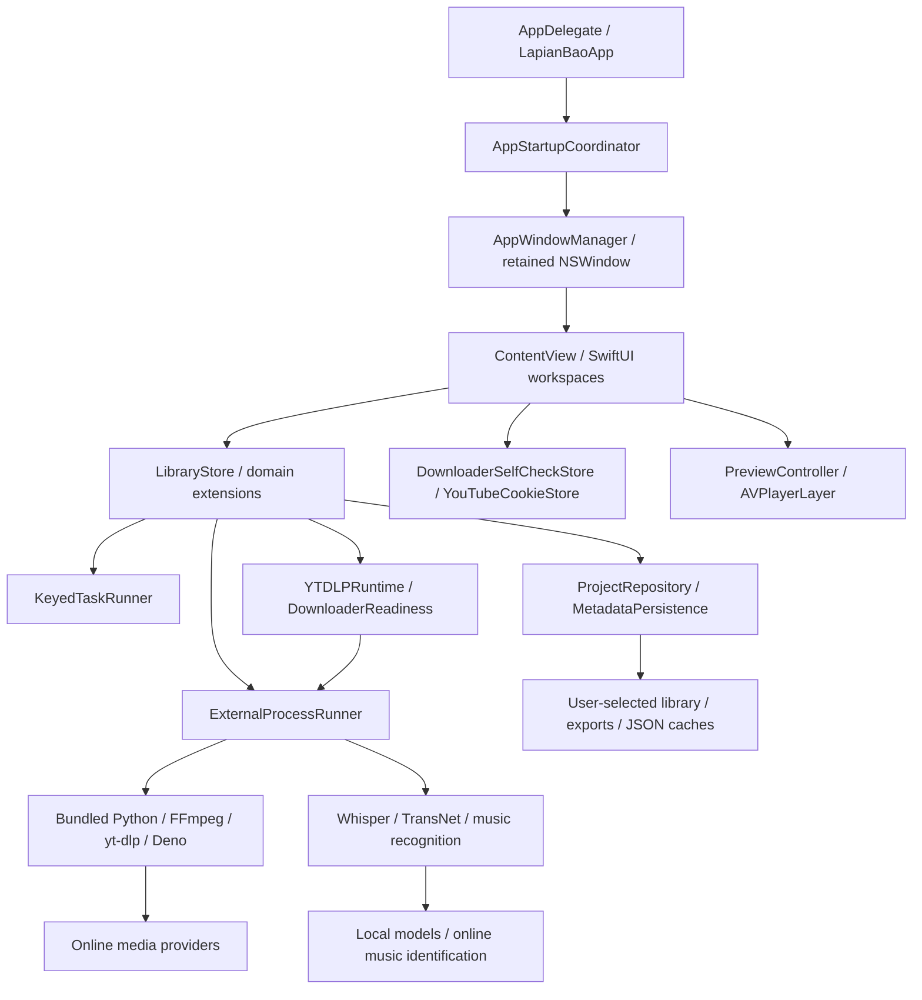

# ShotPal Pro

A native macOS tool for studying films, capturing frames, extracting audio, and building a reusable reference library.

**macOS 14+ · Apple silicon (M-series) · English / 简体中文**

[Download & install](#download-and-install) · [Quick start](#quick-start) · [Feature previews](#feature-previews) · [For developers](#for-developers)

## Download and install

> **Release candidate: 1.2.1, build 2026090901.** The installer is Developer ID–signed. Apple notarization and clean-Mac acceptance are pending, so this is not yet the final launch. Public installer downloads are available in [ShotPal-Releases](https://github.com/zhengshihong66y-max/ShotPal-Releases/releases/tag/v1.2.1-rc.2026090901). This source repository and its complete developer package remain private.

1. Open the [public 1.2.1 release candidate](https://github.com/zhengshihong66y-max/ShotPal-Releases/releases/tag/v1.2.1-rc.2026090901).
2. Under **Assets**, download `ShotPal-Pro-1.2.1-build2026090901-macOS14-AppleSilicon.dmg` (about 918 MiB).
3. Once the release has passed notarization, open the DMG, drag the app to **Applications**, then eject the disk image.
4. Launch the app from Applications and choose a writable folder for your library. This candidate may be blocked by Gatekeeper until notarization is completed; do not disable macOS security to install it.

| Release asset | Who needs it |
| :-- | :-- |
| `ShotPal-Pro-…-macOS14-AppleSilicon.dmg` | Users: the complete application, including all required local runtimes and models. |
| `ShotPal-Pro-…-Complete-Developer-Package.tar.gz` | Authorized developers, via the private source release: source, Xcode project, tools, bundled runtime, models, dependency notices, and Whisper submodule source. |
| `SHA256SUMS.txt` | The public release checksums the installer; the private source release checksums both complete packages. A checksum verifies file integrity, not Apple approval. |

**Use the DMG to install.** GitHub's **Code → Download ZIP** and **Source code (zip/tar.gz)** links contain developer source files, not the application. You do not need Xcode, Git, Python, Homebrew, or a separate model download to use a complete release installer.

Intel Macs, Windows, Linux, and macOS versions below 14 are not supported by this build. The app may appear as **拉片宝** in Finder or system dialogs; this is the same product as ShotPal Pro.

### Installation help

- **The source release shows 404:** the development repository is private. Use the [public installer release](https://github.com/zhengshihong66y-max/ShotPal-Releases/releases/tag/v1.2.1-rc.2026090901) for downloads without an account.
- **macOS rejects the app or reports it damaged:** download the official installer again. If it still fails, report the exact warning and your macOS version. A public release must pass signing and notarization checks; disabling Gatekeeper is not an installation step.
- **The app cannot save files:** choose a local folder you can write to and allow access when macOS asks. Keep your original media and library metadata together when backing up.
- **The app opens in the wrong language:** it follows your macOS preferred app language. Quit and reopen it after changing the language. English is the fallback for unsupported languages.
- **A link cannot be downloaded:** online providers may require a browser login or restrict access. Local video import does not depend on those services.

## Using ShotPal Pro

ShotPal Pro is a film-analysis and reference tool for filmmakers, not a video editor. Study cuts, save exact frames, extract sound, transcribe dialogue, identify music, and export storyboards. Take the material you select into your editing software to build your next project.

### Requirements and language

- macOS 14 or later on an Apple silicon Mac.
- This build supports English and Simplified Chinese, following your macOS preferred app language. Quit and reopen the app after changing that language. Other unsupported languages fall back to English.
- Scene detection and subtitle transcription use bundled local tools and models. Online imports and music recognition require internet access; some platforms may also require browser cookies.

### Quick start

1. **Choose your library.** Open ShotPal Pro and select a folder on your Mac. This is where the app keeps your library and exported material.
2. **Bring in a film.** Open a video from that folder, or use **+** to paste a supported public link and download it. Use material you have permission to work with.
3. **Explore the timeline.** Use Scene Mode to detect cuts and navigate between shots. Generate subtitles to follow the dialogue, or open the Music tab to identify tracks.
4. **Keep what you need.** Save frames, export an audio range, or create a storyboard. Drag saved frames, audio, and music from the export panel into compatible editing software.

### Preview shortcuts

These are the default shortcuts while the video preview is active.

| Key | Action |
| :-- | :-- |
| `Space` | Play / pause |
| `←` / `→` | Previous / next frame |
| `↑` / `↓` | Previous / next detected cut |
| `E` | Save the current frame |
| `I` / `O` | Set the audio range's In / Out points |
| `P` | Export the selected audio range |
| `U` | Clear the audio selection |

### Your files

Exported frames, audio, transcripts, storyboards, and downloaded music are saved in subfolders of your chosen library. Keep the library folder, its metadata, and your original videos together when backing up your work.

Scene detection and subtitle transcription run locally on your Mac. Online imports and music lookups need an internet connection.

## Feature previews

<details>
<summary>Show the product demo and eight feature previews</summary>

<p align="center">
  <a href="https://shotpal.newtybei.com/#overview-story">
    
  </a>
</p>

<p align="center">
  <a href="https://shotpal.newtybei.com/#overview-story"><strong>▶ Watch the latest interactive product demo</strong></a><br>
  <sub>The first frame is a complete overview when animated images are disabled.</sub>
</p>


<a name="showcase"></a>

<p align="center">
  
</p>

<p align="center">
  
</p>

<p align="center">
  
</p>

<p align="center">
  
</p>

<p align="center">
  
</p>

<p align="center">
  
</p>

<p align="center">
  
</p>

<p align="center">
  
</p>


</details>

## For developers

`Pro1.2` is the only development mainline and the default branch.

The native app uses SwiftUI and AppKit. `ContentView` hosts the interface; `LibraryStore` owns application state and delegates workflows to domain extensions. `AppStartupCoordinator` and `AppWindowManager` handle startup and windows. `ProjectRepository` owns library persistence, and `ExternalProcessRunner` runs bundled media workers.

| Path | Purpose |
| :-- | :-- |
| `LapianBao/Views/` | Screens and reusable interface components. |
| `LapianBao/Stores/` | Import, library, scene, subtitle, and music workflows. |
| `LapianBao/Models/` | Library and presentation data models. |
| `LapianBao/AppStartup/` | Application startup and window lifecycle. |
| `LapianBao/en.lproj/`, `LapianBao/zh-Hans.lproj/` | English and Simplified Chinese interface resources. |
| `LapianBao/RuntimeTools.bundle/` | Bundled media executables, Python, models, and dependency notices. |
| `LapianBao.xcodeproj/` | Xcode project; scheme `LapianBao`. |
| `Tools/` | Runtime preparation, validation, regression checks, and packaging. |
| `docs/assets/github/` | README illustrations and historical marketing exports. |
| `IconDrafts/` | Historical design files; not needed for installation. |
| `AGENTS.md` | Internal engineering instructions, currently in Chinese. |
| `Dist/` | Local generated installers and verification reports; excluded from Git. |

### Architecture and ownership

This map describes the complete Pro application at source revision `a2d1d082`, used for version 1.2.1, build 2026090901. The separate App Store clean edition is a different working tree and is not part of this release.



#### Application layers

| Layer | Source owners | Responsibility |
| :-- | :-- | :-- |
| Startup and windows | `LapianBaoApp.swift`, `AppStartup/` | AppKit lifecycle, menu, retained window, activation, keyboard monitoring, and deferred library restoration after the window appears. |
| Workspace shell | `ContentView.swift`, `Views/AppShell/` | Workspace selection, layout, cross-workspace navigation, and overlays. |
| User interface | `Views/Library/`, `Frames/`, `Music/`, `Preview/`, `Settings/`, `Components/`, `Shared/`, `Design/` | Library browsing, film analysis, reference assets, settings, reusable native controls, and visual constants. |
| Playback | `PreviewController.swift`, `PlaybackTimelineAnimation.swift`, `Views/Preview/` | AVFoundation playback, preview controls, timeline presentation, and keyboard interaction. |
| Application state | `LibraryStore.swift`, `Stores/LibraryStore+*.swift` | Observable state and domain operations. Domain extensions remain part of the same store; they are not independent services. |
| Independent domain stores | `Stores/DownloaderSelfCheckStore.swift`, `Stores/YouTubeCookieStore.swift` | Downloader diagnostics and explicitly enabled cookie export. Injected with LibraryStore into the SwiftUI environment. |
| Models and projections | `Models/`, `Stores/LibraryStore+PresentationProjection.swift` | Codable library records, media models, indexes, tags, and cached presentation data. |
| Persistence | `ProjectRepository.swift`, `MetadataPersistence.swift` | Library JSON locations, atomic writes, metadata recovery, pending writes, and retry handling. |
| Background execution | `KeyedTaskRunner.swift`, `ExternalProcessRunner.swift`, `ExternalProcessRunner+Termination.swift` | Per-key task ownership, generation tokens, cancellation, process pipes, timeouts, and descendant-process termination. |
| Runtime integration | `YTDLPRuntime.swift`, `Stores/LibraryStore+LocalTools.swift`, `Stores/LibraryStore+PythonRuntimes.swift` | Prepared downloader readiness and isolated access to bundled tools and recognition dependencies. |
| Preferences and events | `AppSettings.swift`, `AppEventBus.swift`, `L10n.swift`, `en.lproj/`, `zh-Hans.lproj/` | Preferences, application notifications, and English/Simplified Chinese interface resources. |

#### Domain workflows

| Workflow | Store extension owners | Processing and result |
| :-- | :-- | :-- |
| Open a library | `LaunchAndRemoteImports`, `LibraryFolders`, `PersistenceAndSources`, `IndexesAndBasics`, `VideoLibraryAndTags` | Restore the chosen folder, enumerate media, read project metadata, rebuild indexes, and present the library. |
| Import online media | `RemoteDownload`, `RemoteDownloadTypes`, `YTDLPDownload`, `CobaltDownload`, `XiaohongshuDownload`, `RemoteTranscoding` | Track import jobs, call the selected provider/downloader, transcode when needed, and add resulting files to the library. |
| Detect scenes | `SceneDetection`, `TimelineMedia`, `TranscriptExportAndSceneCache` | Run local TransNet inference, store cut times, and generate representative frames and timeline caches. |
| Transcribe dialogue | `CaptureTranscriptMusic`, `TranscriptExportAndSceneCache` | Process audio using the bundled Whisper runtime/model, track transcript status, and export subtitles. |
| Capture and export | `CaptureTranscriptMusic`, `Annotations`, `MetadataAndExportHelpers`, `TimelineMedia` | Save frames, annotations, audio ranges, and reference material with associated project records. |
| Identify and organize music | `MusicDetection`, `MusicPackaging`, `CaptureTranscriptMusic` | Identify tracks through online music services, manage local assets and downloads, and preserve music metadata. |
| Filter and render | `PresentationProjection`, `IndexesAndBasics`, `VideoLibraryAndTags` | Build filtered/indexed views and cached projections without making views own persistence or external processes. |

All names in the workflow table refer to `Stores/LibraryStore+<name>.swift`. Online music catalog search is currently disabled in production; the music workspace searches the existing library. Music identification and existing download workflows remain available.

#### Data, concurrency, and failure boundaries

Library data stays in the folder chosen by the user. `ProjectRepository.FileName` defines `.lapianbao_project.json`, `.lapianbaotags.json`, `.lapianbao_sources.json`, `.lapianbao_scene_cuts.json`, `.lapianbao_waveforms.json`, `.lapianbao_videos_cache.json`, `.lapianbao_resource_cache.json`, `.lapianbao_music_workspace_cache.json`, and `.lapianbao_asset_tags.json`.

Video, image, sound-effect, and music tags are independent domains. Display translations do not rename persisted identifiers or user content. Missing original media does not automatically delete saved frame records or exported images.

Views send user intentions to stores. External processes and project writes have central owners. Project reads distinguish missing files from unreadable data; failed writes preserve pending changes for recovery. A shared write lock and cancellation checks protect atomic commits. Keyed task generations prevent an old completion from clearing a replacement task. Comprehensive active-job shutdown testing and a known waveform cancellation bookkeeping issue remain outstanding.

#### Bundled dependencies and release artifacts

`LapianBao/RuntimeTools.bundle/` contains the prepared media tools, Python runtime, dependency notices, recognition dependency closure, and models. yt-dlp/EJS, Deno, FFmpeg/ffprobe, Whisper, TransNet, and music-recognition dependencies support the workflows above. Scene detection and transcription run locally; online import and music identification require a network connection. First launch does not install dependencies through Homebrew or pip.

`LapianBao.xcodeproj` builds the native app with scheme `LapianBao`. `Tools/` owns preparation, lock/manifest checks, regression checks, runtime verification, localization checks, and release packaging. `Tools/whisper.cpp` is a pinned third-party submodule. `docs/assets/github/` holds documentation media; `IconDrafts/` holds historical design material.

The complete developer release archive contains the source, Xcode project, scripts, checked-out Whisper source, bundled runtime, models, dependency notices, and `PACKAGE-MANIFEST.json` with 25,576 file records and the source revision. The ordinary GitHub source ZIP omits ignored runtime payloads. Build caches, credentials, user libraries, and local installers are excluded. The user installer is a separate DMG containing the complete application.

### Build from the complete developer package

Authorized developers can download `ShotPal-Pro-1.2.1-build2026090901-Complete-Developer-Package.tar.gz` from the [private source release](https://github.com/zhengshihong66y-max/LapianBao/releases/tag/v1.2.1-rc.2026090901). This archive includes the large Whisper model, the prepared recognition dependencies, and the checked-out Whisper submodule source. It excludes personal settings, credentials, build caches, Git history, and old installers. `PACKAGE-MANIFEST.json` records file hashes and the source revision.

Extract it on an Apple silicon Mac with Xcode installed, then open Terminal in the extracted directory:

```sh
python3 Tools/check_download_bundle_inputs.py
python3 Tools/check_recognition_bundle_inputs.py
python3 Tools/check_localizations.py
python3 Tools/regression_checks.py
xcodebuild -project LapianBao.xcodeproj -scheme LapianBao -configuration Debug -destination 'platform=macOS' CODE_SIGN_IDENTITY=- CODE_SIGNING_REQUIRED=NO DEVELOPMENT_TEAM= build
```

This produces a local development build. Distribution requires your own Developer ID identity and notarization credentials; no signing private keys are included. The source is shared for inspection and collaboration with authorized readers; see the licensing note below before redistribution.

### Build from a Git checkout

```sh
git clone --branch Pro1.2 --recurse-submodules https://github.com/zhengshihong66y-max/LapianBao.git
cd LapianBao
```

A Git checkout and GitHub's automatic source ZIP omit large runtime payloads. Use the complete developer package for an already-prepared source tree. Alternatively, use `Tools/prepare_download_runtime.py` and `Tools/prepare_recognition_runtime.py` to prepare pinned assets, and supply `LapianBao/RuntimeTools.bundle/Contents/Resources/Tools/whisper.cpp/models/ggml-large-v3-turbo-q5_0.bin`. The recognition preparation script refuses to overwrite an existing dependency tree. Run the input checks above before building.

No release dependency is installed on a user's first launch. Internal library folder names and persisted identifiers remain stable across interface languages.

### Release packaging

`Tools/package_portable_release.py` creates a candidate DMG and verification evidence. Use an English asset name such as `ShotPal-Pro-1.2.1-macOS14-AppleSilicon`; the version must match the built app. Candidate packaging does not notarize or publish a release. Ad-hoc signing is only for local testing.

After Developer ID signing and Apple notarization, staple the ticket to the DMG. Run `python3 Tools/verify_public_release.py path/to/installer.dmg` to check the final image and generate its SHA-256 file. Mark a release stable only after clean-machine acceptance. Candidates may be uploaded earlier with their signing, notarization, and acceptance status stated explicitly. The verification tool does not publish anything.

The complete developer archive is created with `python3 Tools/package_developer_release.py --output Dist/<name>.tar.gz` from a clean, committed source tree. Large installers and developer archives belong in Releases, where each asset must be smaller than 2 GiB; they are intentionally excluded from Git history.

Known candidate limitations: waveform cancellation can leave stale task bookkeeping; comprehensive active-job shutdown and clean macOS 14 / target-Mac acceptance remain outstanding. These are separate from the completed metadata persistence fixes.

There is currently no project-wide source license file. Third-party components retain their own licenses and notices; acknowledgements below do not grant a license to ShotPal Pro's source.

## Open-source acknowledgements

ShotPal Pro builds on the work of these open-source communities. Thank you to their maintainers and contributors.

| Project | What it makes possible |
| :-- | :-- |
| [yt-dlp](https://github.com/yt-dlp/yt-dlp) | Download video and audio from supported online sources. |
| [FFmpeg and ffprobe](https://ffmpeg.org/) | Inspect and process media, convert formats, and extract audio. |
| [Whisper](https://github.com/openai/whisper) and [whisper.cpp](https://github.com/ggml-org/whisper.cpp) | Transcribe dialogue into subtitles locally on your Mac. |
| [TransNet V2](https://github.com/soCzech/TransNetV2) and its [PyTorch implementation](https://github.com/allenday/transnetv2_pytorch) | Detect shot boundaries for scene-by-scene film analysis. |
| [ShazamIO](https://github.com/shazamio/ShazamIO) | Connect to the online Shazam service to identify music. |

The supporting runtime also uses [Python](https://www.python.org/), [python-build-standalone](https://github.com/astral-sh/python-build-standalone), [Deno](https://github.com/denoland/deno), [PyTorch](https://pytorch.org/), and [NumPy](https://numpy.org/).

These credits highlight the main projects, not every transitive dependency. Each project retains its own license and copyright notices.

<p align="center">
  <a href="https://shotpal.newtybei.com"><strong>Release updates</strong></a>
  &nbsp;·&nbsp;
  <a href="https://shotpal.newtybei.com/privacy">Privacy policy</a>
</p>
