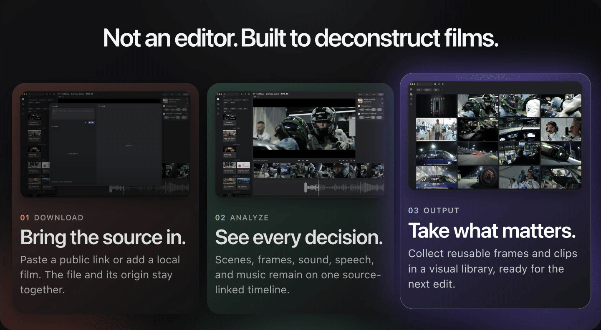
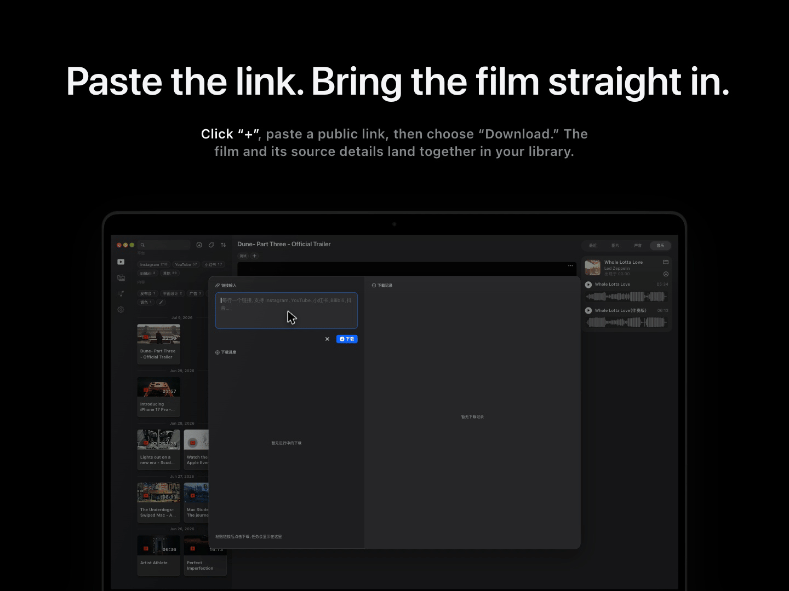
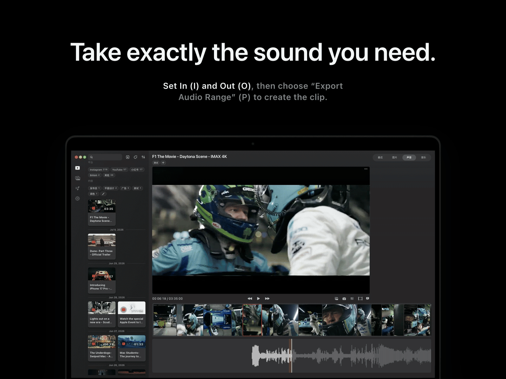
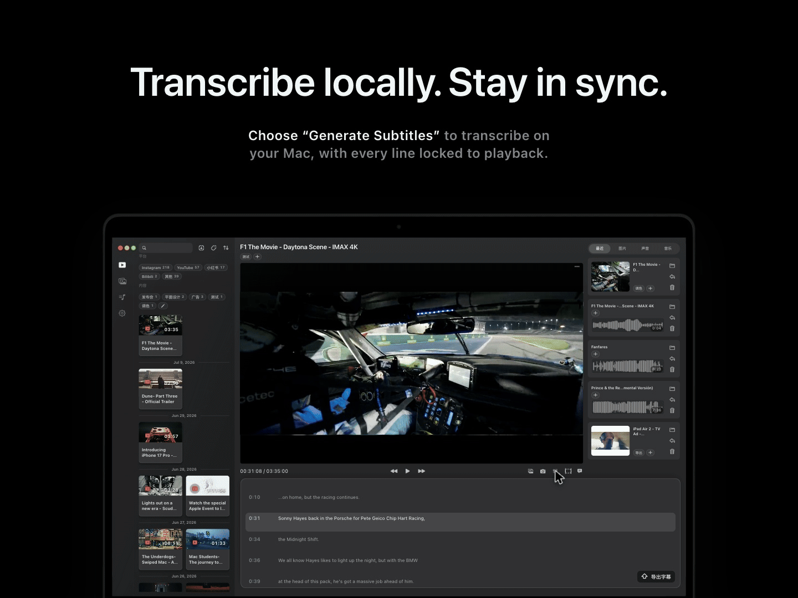
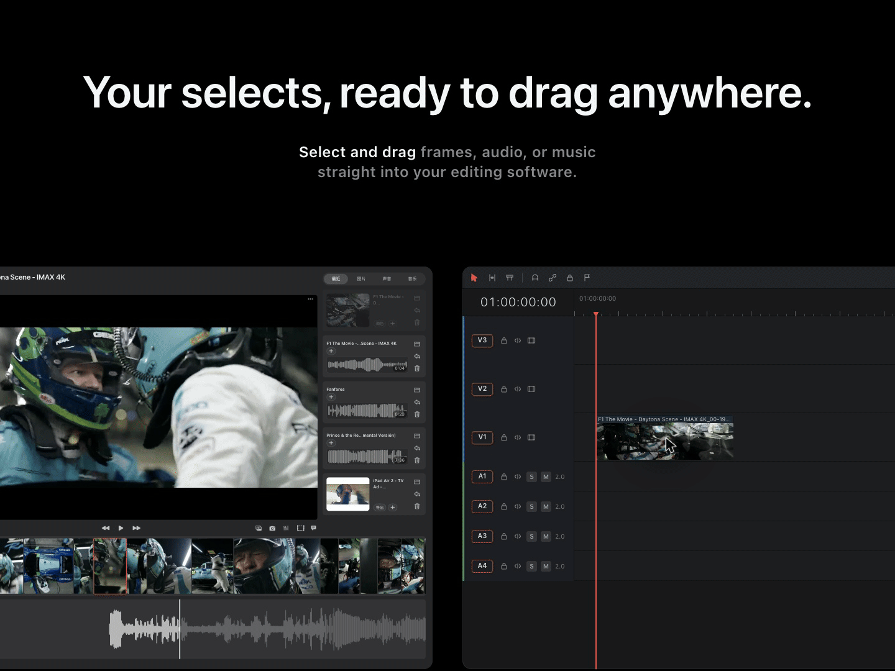
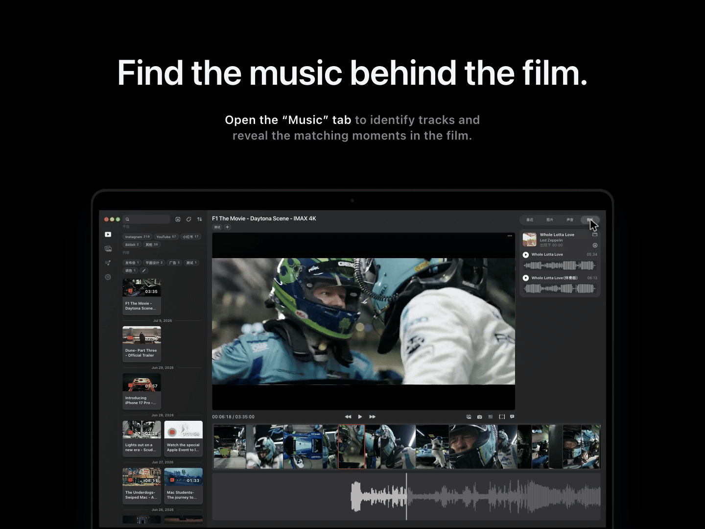

  

  

  <a href="https://shotpal.newtybei.com"><strong>Official website</strong></a>
  &nbsp;·&nbsp;
  <a href="#showcase">See how it works</a>

  

  

  

  

  

  

  

  

  

  <a href="https://shotpal.newtybei.com"><strong>Get ShotPal Pro</strong></a>
  &nbsp;·&nbsp;
  <a href="https://shotpal.newtybei.com/privacy">Privacy policy</a>

