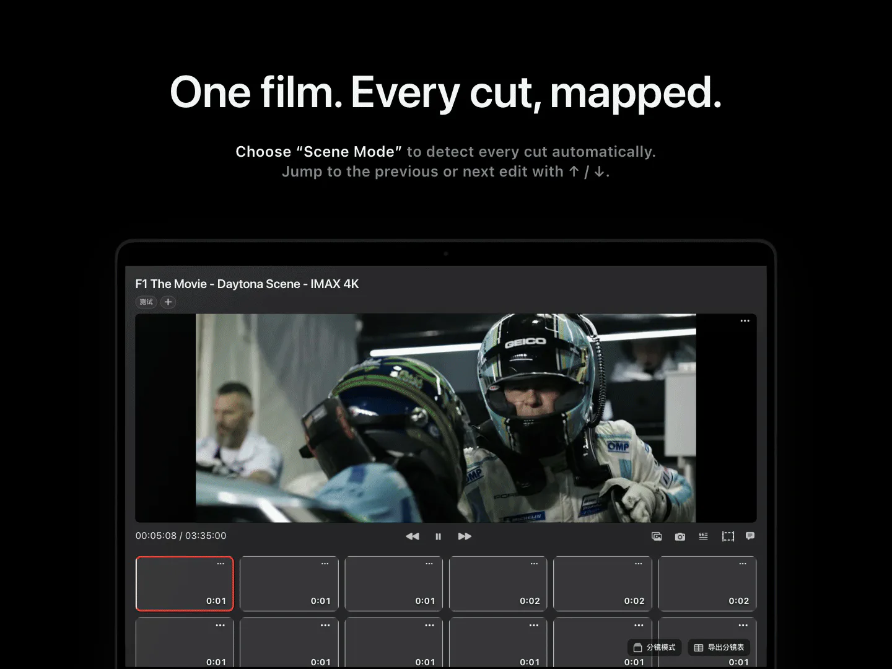
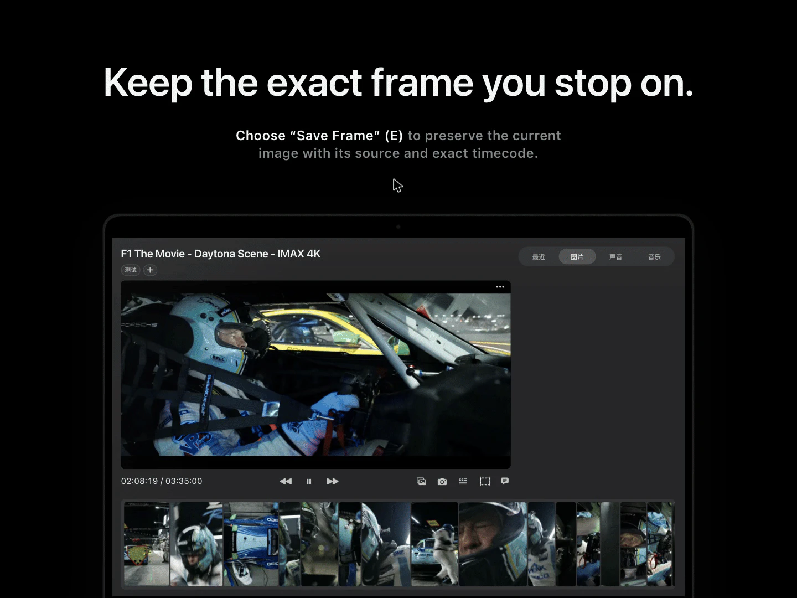
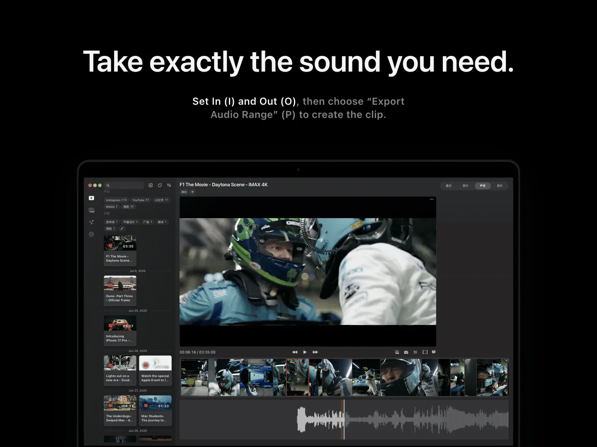
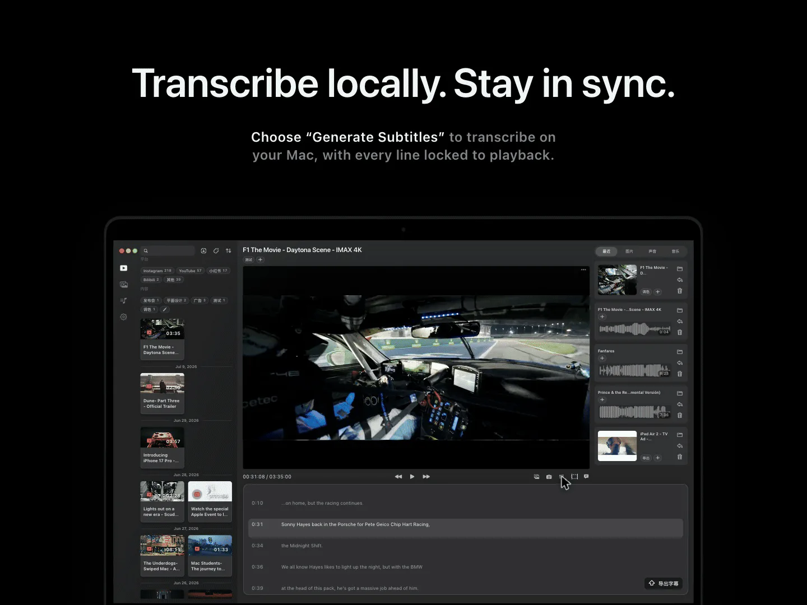
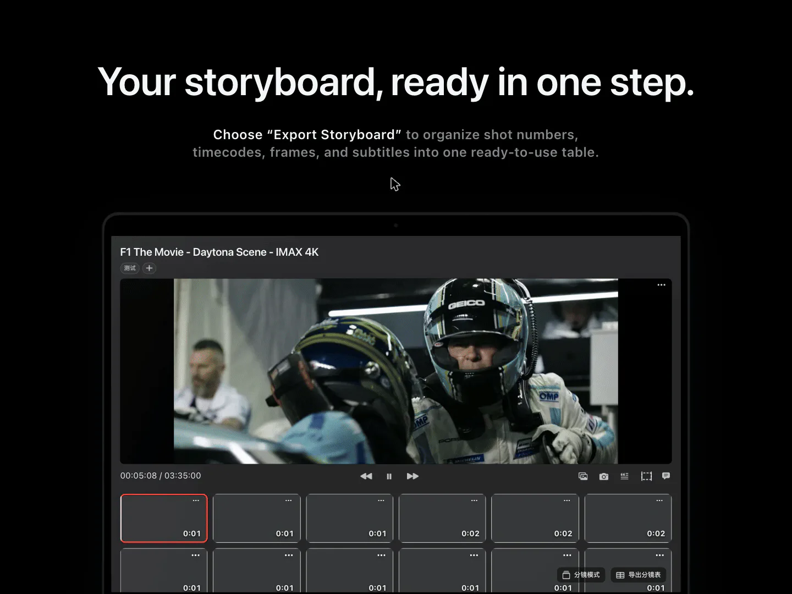
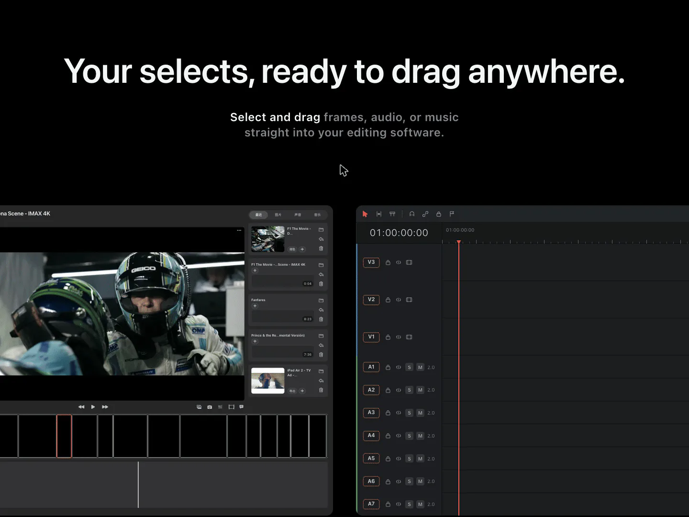
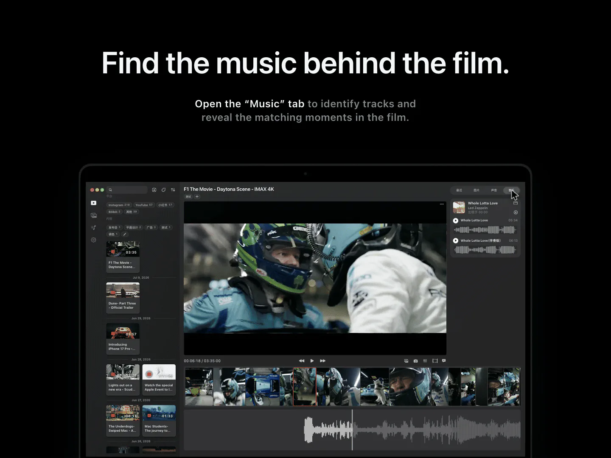

  

  

  

  

  

  

  

  

  

  

## Using ShotPal Pro

ShotPal Pro is a film-analysis and reference tool for filmmakers, not a video editor. Study cuts, save exact frames, extract sound, transcribe dialogue, identify music, and export storyboards. Take the material you select into your editing software to build your next project.

### Quick start

1. **Choose your library.** Open ShotPal Pro and select a folder on your Mac. This is where the app keeps your library and exported material.
2. **Bring in a film.** Open a video from that folder, or use **+** to paste a supported public link and download it. Use material you have permission to work with.
3. **Explore the timeline.** Use Scene Mode to detect cuts and navigate between shots. Generate subtitles to follow the dialogue, or open the Music tab to identify tracks.
4. **Keep what you need.** Save frames, export an audio range, or create a storyboard. Drag saved frames, audio, and music from the export panel into compatible editing software.

### Preview shortcuts

These are the default shortcuts while the video preview is active.

| Key | Action |
| :-- | :-- |
| `Space` | Play / pause |
| `←` / `→` | Previous / next frame |
| `↑` / `↓` | Previous / next detected cut |
| `E` | Save the current frame |
| `I` / `O` | Set the audio range's In / Out points |
| `P` | Export the selected audio range |
| `U` | Clear the audio selection |

### Your files

Exported frames, audio, transcripts, storyboards, and downloaded music are saved in subfolders of your chosen library. Keep the library folder, its metadata, and your original videos together when backing up your work.

Scene detection and subtitle transcription run locally on your Mac. Online imports and music lookups need an internet connection.

## Open-source acknowledgements

ShotPal Pro builds on the work of these open-source communities. Thank you to their maintainers and contributors.

| Project | What it makes possible |
| :-- | :-- |
| [yt-dlp](https://github.com/yt-dlp/yt-dlp) | Download video and audio from supported online sources. |
| [FFmpeg and ffprobe](https://ffmpeg.org/) | Inspect and process media, convert formats, and extract audio. |
| [Whisper](https://github.com/openai/whisper) and [whisper.cpp](https://github.com/ggml-org/whisper.cpp) | Transcribe dialogue into subtitles locally on your Mac. |
| [TransNet V2](https://github.com/soCzech/TransNetV2) and its [PyTorch implementation](https://github.com/allenday/transnetv2_pytorch) | Detect shot boundaries for scene-by-scene film analysis. |
| [ShazamIO](https://github.com/shazamio/ShazamIO) | Connect to the online Shazam service to identify music. |

The supporting runtime also uses [Python](https://www.python.org/), [python-build-standalone](https://github.com/astral-sh/python-build-standalone), [Deno](https://github.com/denoland/deno), [PyTorch](https://pytorch.org/), and [NumPy](https://numpy.org/).

These credits highlight the main projects, not every transitive dependency. Each project retains its own license and copyright notices.

  <a href="https://shotpal.newtybei.com"><strong>Get ShotPal Pro</strong></a>
  &nbsp;·&nbsp;
  <a href="https://shotpal.newtybei.com/privacy">Privacy policy</a>

